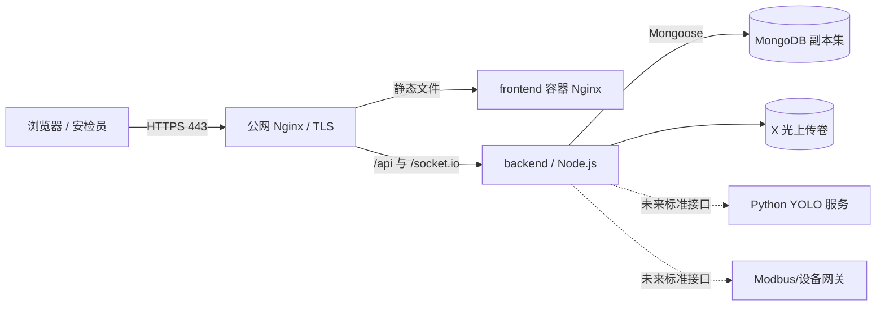

# 部署指南

> 本项目是铁路安检辅助决策的**教学与功能演示原型**。YOLO、气体和设备数据均为模拟数据，未经过真实安检设备、真实模型或现场安全认证，不能替代安检人员判断。

本文以 Docker Compose 为主方案，同时说明不使用 Docker 时的部署思路。当前开发机未安装 Docker，因此仓库中的容器配置经过静态校对，但**没有在本机实际执行容器构建或启动**；部署前必须在目标机器完成第 8 节验收。

## 1. 生产拓扑



生产环境建议：

- 只暴露公网 Nginx 的 80/443；后端和 MongoDB 留在内网。
- 使用受信任 CA 签发的 HTTPS 证书，并将 HTTP 永久跳转到 HTTPS。
- MongoDB 使用副本集、身份认证、独立账号和定期备份；不要把 27017 暴露到互联网。
- 上传目录、数据库和日志使用持久卷；镜像本身应视为可随时替换。
- JWT 密钥、数据库凭据由部署平台 Secret 或服务器环境变量注入，不写入镜像、Git 或前端。

## 2. Docker Compose 快速启动

### 2.1 前置条件

- Docker Engine 24+ 与 Docker Compose v2；Windows 11 可安装 Docker Desktop 并启用 WSL 2 后端。
- 至少 4 GB 可用内存和足够的数据库/上传文件磁盘空间。
- 项目目录不能包含真实 `.env` 的 Git 提交记录。

在 Windows PowerShell 检查：

```powershell
docker version
docker compose version
```

在 WSL 检查：

```bash
docker version
docker compose version
```

### 2.2 创建仅供 Compose 读取的根 `.env`

不要覆盖已有 `.env`。若根目录没有 `.env`，从示例复制后生成强随机密钥：

Windows PowerShell：

```powershell
Copy-Item .env.example .env
$bytes = New-Object byte[] 48
[Security.Cryptography.RandomNumberGenerator]::Fill($bytes)
[Convert]::ToBase64String($bytes)
```

WSL：

```bash
cp .env.example .env
openssl rand -base64 48
```

把输出填入 `.env` 的 `JWT_SECRET`，并检查：

```dotenv
JWT_SECRET=请替换为至少32字节的随机值
CLIENT_ORIGIN=http://localhost:5174
SOCKET_CORS_ORIGIN=http://localhost:5174
```

不要使用示例文字、用户名或短密码作为 JWT 密钥。生产域名部署时将两个 Origin 改为准确的 HTTPS 地址，不要写 `*`。

### 2.3 构建并启动

```powershell
docker compose config
docker compose build
docker compose up -d
docker compose ps
```

WSL 中命令相同。`docker-compose.yml` 包含：

- `mongodb`：MongoDB 8.0 单节点副本集数据节点；
- `mongodb-init`：幂等初始化 `rs0`，用于真正支持多文档事务；
- `backend`：Express、Socket.IO、上传目录；
- `frontend`：Vite 构建产物与 Nginx 反向代理。

默认入口：

- 前端：<http://localhost:5174>
- 后端健康检查：<http://localhost:5000/api/v1/health>
- MongoDB：仅为本机开发映射 `localhost:27017`；生产部署应移除该端口映射。

### 2.4 初始化演示数据

首次启动后执行：

```powershell
docker compose exec backend npm run migrate
$env:SEED_DEFAULT_PASSWORD="仅在当前终端临时设置、至少8位且含字母数字的密码"
docker compose exec -e "SEED_DEFAULT_PASSWORD=$env:SEED_DEFAULT_PASSWORD" backend npm run seed
Remove-Item Env:SEED_DEFAULT_PASSWORD
```

`seed` 需要临时 `SEED_DEFAULT_PASSWORD`；脚本会防止无意重复插入。WSL 可用 `read -s SEED_DEFAULT_PASSWORD`、`export SEED_DEFAULT_PASSWORD` 后执行 `docker compose exec -e SEED_DEFAULT_PASSWORD="$SEED_DEFAULT_PASSWORD" backend npm run seed`，完成后 unset。也可只创建管理员：

```bash
docker compose exec backend sh
export ADMIN_USERNAME='admin'
export ADMIN_EMAIL='admin@163.com'
read -s ADMIN_PASSWORD && export ADMIN_PASSWORD
npm run create-admin
unset ADMIN_USERNAME ADMIN_EMAIL ADMIN_PASSWORD
exit
```

脚本要求三个环境变量，不会覆盖已有邮箱或密码。不要把真实密码值写进命令历史、Compose 文件或仓库。

### 2.5 日志、停止与更新

```powershell
docker compose logs -f --tail 200 backend
docker compose logs -f --tail 100 mongodb
docker compose stop
```

更新代码后：

```powershell
docker compose build --pull
docker compose up -d
docker compose exec backend npm run migrate
```

`docker compose down` 会删除容器和网络，但默认保留命名卷。**不要执行 `docker compose down -v`**，它会删除 MongoDB 与上传卷，属于数据破坏操作。

## 3. MongoDB 与事务

“创建检测记录 + 创建报警”需要多文档事务。事务要求 MongoDB 运行在副本集或分片集群中：

- Compose 通过单节点 `rs0` 提供可开发验证的事务环境，后端设置 `TRANSACTION_MODE=required`。
- 直接连接本地独立 `mongod` 时，设置 `TRANSACTION_MODE=auto`。代码会明确记录“不支持事务”，并使用补偿式降级；这不是原子事务，不应被描述为事务成功。
- 生产环境应使用至少三节点副本集，并测试主节点切换、重试写入、备份与恢复。

检查副本集：

```powershell
docker compose exec mongodb mongosh --quiet --eval "rs.status().members.map(m => ({name:m.name,stateStr:m.stateStr}))"
```

从 Windows 主机使用 `mongosh` 连接 Compose 的单节点副本集时，拓扑会返回内部主机名 `mongodb`。最简单的管理方式是使用上面的 `docker compose exec`；不要通过修改 hosts 的方式处理生产拓扑。

## 4. 环境变量

后端关键变量：

| 变量 | 作用 | 生产建议 |
|---|---|---|
| `NODE_ENV` | 运行环境 | `production` |
| `PORT` | HTTP/Socket.IO 端口 | 容器内 `5000` |
| `MONGO_URI` | MongoDB 连接串 | Secret 注入，带副本集与认证参数 |
| `JWT_SECRET` | JWT 签名密钥 | 至少 32 字节随机值，定期轮换 |
| `JWT_EXPIRES_IN` | Token 有效期 | 按组织策略，例如 `8h` |
| `CLIENT_ORIGIN` | REST CORS 来源 | 准确 HTTPS 前端域名 |
| `SOCKET_CORS_ORIGIN` | Socket.IO 来源 | 准确 HTTPS 前端域名 |
| `UPLOAD_DIR` | 上传目录 | 持久卷内相对路径 |
| `MAX_UPLOAD_SIZE` | 图片上限（字节） | 默认 5 MiB，结合 Nginx 限制 |
| `LOG_LEVEL` | 日志级别 | 通常 `info`，排障临时 `debug` |
| `TRANSACTION_MODE` | 事务策略 | 副本集生产环境用 `required` |
| `SIMULATION_ENABLED` | 是否开放模拟接口 | 演示环境 `true`，正式现场默认 `false` |

前端 `VITE_*` 变量在**构建时**写入静态文件，不是运行时 Secret：

- `VITE_API_BASE_URL=/api/v1`：使用同源 Nginx 代理；
- `VITE_SOCKET_URL=`：留空时使用当前页面 Origin（以实际前端实现为准）。

任何秘密都不能以 `VITE_` 开头。

## 5. 公网 Nginx 与 HTTPS

Compose 内的 `frontend/nginx.conf` 负责 SPA 回退、REST、上传和 WebSocket 转发。公网入口还应配置 TLS。示意配置：

```nginx
server {
    listen 80;
    server_name security.example.edu.cn;
    return 301 https://$host$request_uri;
}

server {
    listen 443 ssl http2;
    server_name security.example.edu.cn;

    ssl_certificate     /etc/letsencrypt/live/security.example.edu.cn/fullchain.pem;
    ssl_certificate_key /etc/letsencrypt/live/security.example.edu.cn/privkey.pem;

    location / {
        proxy_pass http://127.0.0.1:5174;
        proxy_http_version 1.1;
        proxy_set_header Host $host;
        proxy_set_header X-Forwarded-Proto https;
        proxy_set_header Upgrade $http_upgrade;
        proxy_set_header Connection "upgrade";
    }
}
```

证书可用学校统一网关或 Certbot 管理。启用 HTTPS 后同步修改 CORS Origin，并实际测试 Socket.IO 升级请求。若由公网 Nginx 直接代理后端，则仍需为 React 路由配置 `try_files ... /index.html`。

## 6. 不使用 Docker 的部署思路

主方案是 Docker。若课程服务器不允许 Docker，可使用 Node.js 22 + PM2：

```bash
npm ci
npm run build
cd backend
NODE_ENV=production pm2 start server.js --name railway-security-api
pm2 save
```

将 `frontend/dist` 交给系统 Nginx，把 `/api/`、`/uploads/` 和 `/socket.io/` 转发到 `127.0.0.1:5000`。MongoDB 必须单独配置副本集、认证和防火墙。PM2 只管理 Node 进程，不管理数据库、静态文件或备份。

## 7. 日志、监控和备份

- 健康检查：`GET /api/v1/health`，只返回服务状态、数据库状态、时间与版本，不暴露连接串或密钥。
- 应用日志：收集后端标准输出，按级别检索；生产日志不得记录密码、Token、完整数据库 URI 或图片二进制。
- 指标建议：5xx 比例、请求延迟、Socket 连接数、MongoDB 连接池、磁盘空间、设备离线数、未处理报警数。
- 备份：按 [BACKUP_AND_RESTORE.md](./BACKUP_AND_RESTORE.md) 使用 `mongodump`，上传目录另行做文件级快照。
- 告警：数据库不可用、磁盘低水位、备份失败、持续 5xx 应通知维护人员；业务 high 报警仍应由系统页面和人工流程处理。

## 8. 上线前验收清单

以下必须在目标服务器实际执行，不能用“配置文件存在”代替：

1. `docker compose config` 无错误，镜像可以从零构建。
2. `docker compose ps` 全部健康，`mongodb-init` 成功退出。
3. 健康接口数据库状态正常，响应不包含秘密。
4. 运行 `npm run migrate`、`npm run seed` 后三角色可按预期登录。
5. 创建 high 模拟检测时，检测与报警同时写入且 Socket 推送到页面。
6. 断开 Socket 后 REST 页面仍可使用，恢复网络后能重连。
7. 上传允许的图片成功；可执行文件、超限文件被拒绝。
8. 角色权限、逻辑删除/恢复和操作日志经过手工复测。
9. 执行一次备份，在隔离测试库完成恢复演练并核对记录数。
10. 验证 HTTPS、CORS、WebSocket、日志脱敏、防火墙和磁盘监控。

本仓库所在开发机没有 Docker，所以上述容器验收仍属于目标环境待办。README 中标记的本地 Node/MongoDB 测试结果与 Docker 实跑结果必须分开陈述。
