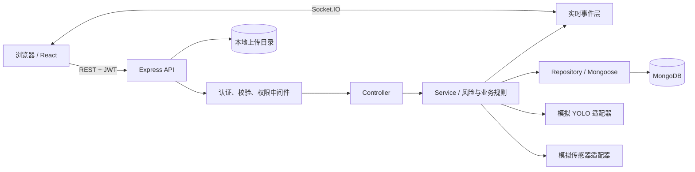
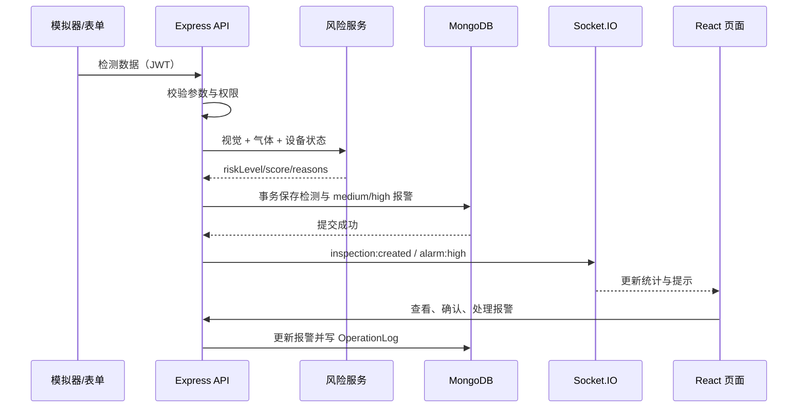

# 基于多模态融合感知技术的铁路安检判图辅助决策系统

这是一个面向本科课程与大创项目的全栈软件原型：接收模拟 X 光检测结果、模拟气体传感器数据、包裹与设备信息，使用可解释规则融合风险，帮助安检员查看、确认和处置报警，并保存历史记录与操作审计。

> **重要边界：**当前 YOLO 结果、气体读数、设备心跳均由模拟适配器产生或由表单输入，仅用于系统开发和功能演示。项目没有连接真实安检仪、真实 YOLO 推理服务或真实传感器，也没有经过准确率、可靠性或现场安全认证。它是“辅助决策系统”，不能替代安检人员。

## 功能概览

- JWT 登录和 `admin`、`inspector`、`viewer` 三角色权限；
- 检测记录新增、详情、修改、分页筛选、排序、逻辑删除和管理员恢复；
- 服务端风险融合，输出 `low`、`medium`、`high`、分数和可解释原因；
- medium/high 风险自动创建报警（high 额外触发醒目实时提示），支持指派、确认、处理中、解决、忽略和管理员重开；
- 设备 CRUD、模拟心跳和超时疑似离线；
- Dashboard 聚合统计、风险趋势、气体统计、危险类别和最新记录；
- 安全图片上传、预览和检测框叠加；
- Socket.IO 推送新检测、高风险报警、报警状态和设备状态；
- 关键写操作写入 `OperationLog`；
- 幂等 seed、迁移、管理员创建、归档 dry-run、备份与恢复脚本；
- 后端单元/集成测试、前端工具测试、ESLint 和 Vite 构建；
- Docker Compose、Nginx、健康检查和部署说明。

## 技术栈

| 层 | 技术 |
|---|---|
| 前端 | React 19、Vite、React Router、原生 CSS、Recharts、Socket.IO Client |
| 后端 | Node.js 22、Express 5、Mongoose、Zod、JWT、bcryptjs、multer、Pino、Socket.IO |
| 数据库 | MongoDB 8（事务环境需副本集） |
| 测试 | Vitest、Supertest、mongodb-memory-server、Testing Library |
| 部署 | Docker Compose、Nginx |

## 系统架构



检测闭环的数据流：



## 目录结构

```text
.
├─ backend/
│  ├─ config/          # 环境、数据库、日志、风险规则
│  ├─ controllers/     # HTTP 请求编排
│  ├─ middleware/      # 登录、角色、校验、上传、错误处理
│  ├─ models/          # 五个 Mongoose 模型
│  ├─ repositories/    # 常用数据库查询
│  ├─ routes/          # /api/v1 路由
│  ├─ services/        # 风险、检测、报警、模拟和适配器
│  ├─ validators/      # Zod 请求结构
│  ├─ scripts/         # seed、迁移、管理员、归档、备份恢复
│  ├─ tests/           # 单元与集成测试
│  ├─ uploads/xrays/   # 本地 X 光图片（运行数据不进 Git）
│  ├─ app.js           # 创建并导出 Express app
│  └─ server.js        # 数据库、HTTP、Socket 与优雅关闭
├─ frontend/
│  ├─ src/api/         # 统一请求与各业务 API
│  ├─ src/components/  # 布局、权限路由、通用 UI
│  ├─ src/context/     # 登录状态与实时连接
│  ├─ src/pages/       # 登录、Dashboard、记录、报警、设备等页面
│  └─ src/utils/       # 格式化和检测框坐标工具
├─ docker-compose.yml
├─ API_DOCUMENTATION.md
├─ LEARNING_NOTES.md
├─ BACKUP_AND_RESTORE.md
└─ DEPLOYMENT.md
```

## 页面与角色

| 页面 | 路径 | admin | inspector | viewer |
|---|---|:---:|:---:|:---:|
| 登录 | `/login` | ✓ | ✓ | ✓ |
| Dashboard | `/` | ✓ | ✓ | ✓ |
| 历史检测 | `/inspections` | ✓ | ✓ | ✓ |
| 新增模拟检测 | `/inspections/new` | ✓ | ✓ | — |
| 检测详情 | `/inspections/:id` | ✓ | ✓ | ✓ |
| 报警中心 | `/alarms` | ✓ | 处置 | 只读 |
| 设备管理 | `/devices` | 管理 | 查看 | 查看 |
| 用户管理 | `/users` | ✓ | — | — |
| 操作日志 | `/logs` | ✓ | — | — |

后端是最终权限边界。隐藏前端按钮只是改善体验，不能替代 API 的 401/403 校验。

## 本地启动（Windows 11 + WSL）

### 1. 环境要求

- Node.js `>= 22`；
- npm `>= 10`；
- MongoDB 7/8；
- Windows 11 PowerShell 或 WSL 2 Ubuntu；
- 推荐 Git 2.40+。

检查：

```powershell
node --version
npm --version
git --version
```

### 2. 安装并启动 MongoDB

#### 方案 A：Windows 服务

从 MongoDB Community Server 官方安装程序安装，并选择“Install MongoD as a Service”。PowerShell 检查：

```powershell
Get-Service MongoDB
Start-Service MongoDB
mongosh "mongodb://127.0.0.1:27017"
```

#### 方案 B：WSL Ubuntu

按 MongoDB 官方 Ubuntu 文档安装与当前发行版匹配的软件源，然后：

```bash
sudo systemctl enable --now mongod
sudo systemctl status mongod
mongosh 'mongodb://127.0.0.1:27017'
```

若 Node 在 Windows、MongoDB 在 WSL，先从 PowerShell 测试 `mongosh "mongodb://127.0.0.1:27017"`。无法连接时优先让 Node 和 MongoDB 都在 WSL 内运行；不要为了排障把 27017 暴露到公共网络。

普通单机 `mongod` 不支持多文档事务。本地 `.env` 使用 `TRANSACTION_MODE=auto` 时，系统会记录并采用补偿式安全降级；这不等同于原子事务。要验证真正事务，请使用本仓库 Compose 的副本集或自行配置本地副本集。

### 3. 安装依赖

在项目根目录执行：

```powershell
npm run install:all
```

也可用标准工作区安装：

```powershell
npm install
```

不要分别删除锁文件或混用多个 Node 大版本。若从 WSL 运行，建议把项目放在 WSL 文件系统中以获得更好的文件监听性能；当前位于 Windows 盘时也可通过 `/mnt/d/判图系统` 访问。

### 4. 配置环境变量

只在文件不存在时复制，**不要覆盖已有 `.env`**：

PowerShell：

```powershell
if (-not (Test-Path backend\.env)) { Copy-Item backend\.env.example backend\.env }
if (-not (Test-Path frontend\.env)) { Copy-Item frontend\.env.example frontend\.env }
```

WSL：

```bash
test -f backend/.env || cp backend/.env.example backend/.env
test -f frontend/.env || cp frontend/.env.example frontend/.env
```

至少编辑 `backend/.env`：

```dotenv
NODE_ENV=development
PORT=5000
MONGO_URI=mongodb://127.0.0.1:27017/railway_security
JWT_SECRET=请填写至少32字节随机值
JWT_EXPIRES_IN=8h
CLIENT_ORIGIN=http://localhost:5174
SOCKET_CORS_ORIGIN=http://localhost:5174
UPLOAD_DIR=uploads/xrays
MAX_UPLOAD_SIZE=5242880
LOG_LEVEL=info
TRANSACTION_MODE=auto
SIMULATION_ENABLED=true
```

生成 JWT 密钥可用：

```powershell
$b = New-Object byte[] 48; [Security.Cryptography.RandomNumberGenerator]::Fill($b); [Convert]::ToBase64String($b)
```

前端默认：

```dotenv
VITE_API_BASE_URL=http://localhost:5000/api/v1
VITE_SOCKET_URL=http://localhost:5000
```

Vite 开发端口为 `5174`，避免与已有 `5173` 服务冲突。任何 `.env` 都不应提交到 Git。

### 5. 初始化数据库

先运行兼容迁移：

```powershell
npm run migrate
```

生成三类用户、设备、至少 50 条模拟记录和报警：

```powershell
$env:SEED_DEFAULT_PASSWORD="在当前终端临时设置的强密码"
npm run seed
Remove-Item Env:SEED_DEFAULT_PASSWORD
```

WSL：

```bash
read -s -p 'Seed password: ' SEED_DEFAULT_PASSWORD; echo
export SEED_DEFAULT_PASSWORD
npm run seed
unset SEED_DEFAULT_PASSWORD
```

管理员的默认 seed 身份是用户名 `admin`、邮箱 `admin@163.com`，也可通过 `.env` 的 `SEED_ADMIN_EMAIL` 修改；其他账号邮箱来自 `SEED_INSPECTOR_EMAIL`、`SEED_VIEWER_EMAIL`。仓库**不在源码或环境变量示例中硬编码密码**；三者使用本次 seed 时通过 `SEED_DEFAULT_PASSWORD` 提供的密码。seed 是幂等的，会避免无意重复插入。

只创建管理员时：

```powershell
$env:ADMIN_USERNAME="admin"
$env:ADMIN_EMAIL="admin@163.com"
$env:ADMIN_PASSWORD="在当前终端临时设置、至少8位且含字母数字的密码"
npm run create-admin
Remove-Item Env:ADMIN_USERNAME,Env:ADMIN_EMAIL,Env:ADMIN_PASSWORD
```

WSL 可用 `read -s ADMIN_PASSWORD` 后导出 `ADMIN_USERNAME`、`ADMIN_EMAIL`、`ADMIN_PASSWORD` 再运行。脚本不覆盖已有邮箱或密码，也不会把密码写入代码；缺少变量时会明确退出。

### 6. 启动系统

一个终端同时启动前后端：

```powershell
npm run dev
```

或分别启动，便于看日志：

```powershell
npm run dev:backend
```

```powershell
npm run dev:frontend
```

打开 <http://localhost:5174>。健康检查：

```powershell
Invoke-RestMethod http://localhost:5000/api/v1/health
```

WSL 中可用 `curl http://localhost:5000/api/v1/health`。

## 常用命令

| 命令 | 作用 |
|---|---|
| `npm run install:all` | 安装根、前端、后端依赖 |
| `npm run dev` | 同时启动前后端开发服务 |
| `npm run dev:frontend` | 只启动 Vite（5174） |
| `npm run dev:backend` | 只启动 API（5000） |
| `npm run build` | 构建前端生产文件 |
| `npm run test` | 依次运行后端与前端测试 |
| `npm run lint` | 检查工作区代码规范 |
| `npm run seed` | 幂等生成演示数据 |
| `npm run migrate` | 执行兼容迁移/索引准备 |
| `npm run create-admin` | 安全创建管理员 |
| `npm run archive:plan --workspace backend` | 只生成归档候选计划，不删除数据 |

归档预演需要明确截止时间：

```powershell
$env:ARCHIVE_BEFORE_DATE="2025-01-01T00:00:00.000Z"
npm run archive:plan --workspace backend
Remove-Item Env:ARCHIVE_BEFORE_DATE
```

默认命令只统计候选记录。脚本的显式 execute 模式也只幂等复制到归档集合，不删除原集合；任何未来物理删除都必须另行审批、备份并先 dry-run。

## 测试与构建

完整检查：

```powershell
npm run lint
npm run test
npm run build
```

2026-07-11 在当前 Windows/WSL 开发机的最新实际结果：

| 检查 | 实际结果 |
|---|---|
| `npm run lint` | 通过 |
| 后端 Vitest | 37 个测试通过 |
| 前端 Vitest | 11 个测试通过 |
| `npm run build` | Vite 生产构建通过 |
| Docker Compose | 本机没有 Docker，未构建、未启动 |

后端测试使用隔离数据库/内存 MongoDB，不指向生产库。后续最新结果仍以 [PROGRESS.md](./PROGRESS.md) 的实际运行记录为准；一次机器通过不等于所有部署环境均通过。容器状态另见 [DEPLOYMENT.md](./DEPLOYMENT.md)。

手工冒烟流程：

1. 用三角色分别登录，确认菜单和写权限不同；
2. 新增一条模拟检测，确认最终风险由服务端计算；
3. 生成 high 记录，确认报警、Dashboard 和实时提示；
4. 安检员按合法顺序处置报警；
5. 管理员逻辑删除再恢复记录，检查操作日志；
6. 上传正常图片，再尝试超限或非图片文件并确认被拒绝；
7. 暂停后端再恢复，观察前端实时连接状态与 REST 降级。

## API 与错误格式

完整接口、权限、查询参数和示例见 [API_DOCUMENTATION.md](./API_DOCUMENTATION.md)。API 基础地址：

```text
http://localhost:5000/api/v1
```

受保护请求使用：

```http
Authorization: Bearer <token>
```

成功响应通常为 `{ "success": true, "data": ... }`；错误统一为：

```json
{
  "success": false,
  "error": {
    "code": "VALIDATION_ERROR",
    "message": "请求参数不合法",
    "details": []
  }
}
```

## 风险融合说明

风险规则位于 `backend/config/riskRules.js`，计算位于 `backend/services/riskService.js`。它综合：

- 危险目标类别、置信度和数量；
- 气体报警、浓度、趋势和传感器状态；
- 视觉与气体证据是否同时出现；
- 数据缺失或传感器故障。

前端提交的风险等级不是最终结果。后端重新计算并保存 `riskScore`、`riskLevel` 和 `riskReasons`。没有有效数据时不会把“数据不足”误写成绝对安全。规则式分数便于课程讲解，但不代表经过真实业务标定。

## Docker 启动

当前开发机未安装 Docker，所以配置尚未在本机实跑。目标机器安装 Docker 后：

```powershell
Copy-Item .env.example .env
# 编辑根 .env，必须设置随机 JWT_SECRET
docker compose config
docker compose build
docker compose up -d
docker compose exec backend npm run migrate
```

Compose 默认使用 MongoDB 单节点副本集来支持事务。详细的生产 Nginx、HTTPS、CORS、健康检查和验收见 [DEPLOYMENT.md](./DEPLOYMENT.md)。停止服务不要带 `-v`，否则会删除命名卷。

## 备份与恢复

数据库脚本：

```bash
export MONGO_URI='mongodb://127.0.0.1:27017/railway_security'
export BACKUP_DIR="$HOME/railway-security-backups"
bash backend/scripts/backup.sh
```

恢复必须先在隔离测试库演练，并按脚本进行二次确认。MongoDB 备份不包含 `backend/uploads` 图片，需同时做文件备份。见 [BACKUP_AND_RESTORE.md](./BACKUP_AND_RESTORE.md)。

## 接入真实 YOLO 的建议步骤

1. 保持 `yoloAdapterService` 的输入/输出契约不变；不要让 Express 直接加载大型 `.pt`。
2. 用独立 Python 服务封装已验证模型，定义版本化 HTTP API、超时、文件大小和鉴权。
3. 建立项目类别到模型类别的显式映射，记录 `modelName`、`modelVersion` 和归一化/像素坐标约定。
4. 在后端增加真实适配器和配置开关，模拟适配器继续用于测试。
5. 做超时、无结果、非法框、模型离线和版本不匹配测试；失败时标记数据不足，不能当作低风险。
6. 用经批准的数据集评估准确率、召回率、误报/漏报与偏差，并由安检专业人员标定阈值。
7. 完成网络隔离、日志脱敏、模型供应链和人工复核流程后，才可进入受控试点。

外部 `D:\安检仪\安检仪` 中的实验权重与脚本没有复制到本 Web 仓库，也没有在本系统中宣称验证通过。

## 接入真实传感器的建议步骤

1. 保持 `sensorAdapterService` 输出结构：气体类型、浓度、单位、报警、趋势、状态和采集时间。
2. 由独立设备网关实现 Modbus-RTU/Modbus-TCP 或供应商协议，处理 CRC、粘包/分包、重连、心跳和时钟同步。
3. 明确寄存器/通道到气体类型和单位的映射，保存原始值、校准版本与设备编号。
4. 通过包裹编号或受控时间窗口关联图像与气体数据，并标注关联质量。
5. 断线、超时、超量程、校准过期应成为“数据不足/设备异常”原因，不能解释为安全。
6. 在模拟网关和测试设备上完成协议向量、边界值和故障注入，再进行现场联调。

参考实验协议目前不足以证明真实浓度、趋势和现场可靠性，不能把模拟字段描述成实测值。

## 常见问题

### 前端打不开或端口被占用

本项目固定使用 5174。检查：

```powershell
Get-NetTCPConnection -LocalPort 5174 -ErrorAction SilentlyContinue
```

不要擅自终止不属于本项目的进程。若确需改端口，同时修改 Vite 配置、`CLIENT_ORIGIN` 和 `SOCKET_CORS_ORIGIN`。

### 后端提示 JWT_SECRET

复制 `.env.example` 不等于配置完成。生成随机值填入 `backend/.env`，不要在代码中设置“临时默认密钥”。

### MongoDB 连接失败

确认服务状态、URI、运行环境和端口；Windows 与 WSL 混用时分别在 Node 所在环境测试 `mongosh`。不要把认证 URI 输出到公开日志。

### 事务不可用

`Transaction numbers are only allowed on a replica set member` 表示当前 MongoDB 是独立实例。开发可用 `TRANSACTION_MODE=auto` 明确降级；要验证原子性请使用副本集。Compose 已配置 `rs0`，但仍需在装有 Docker 的机器实跑。

### 登录失败

先确认执行了 seed/create-admin、使用的是环境变量指定邮箱和本次提供的密码。错误响应故意不区分“用户不存在”和“密码错误”。

### 图片上传失败

只允许常见图片格式且默认不超过 5 MiB。检查 `UPLOAD_DIR` 可写、反向代理 `client_max_body_size` 与后端限制一致。文件扩展名伪装不会绕过服务端类型检查。

### 页面刷新后 404

生产静态服务器必须把未知路径回退到 `index.html`。仓库的 `frontend/nginx.conf` 已包含 `try_files`；自定义服务器也要配置。

### Socket 显示断开但列表可用

实时通道和 REST 是两条路径。检查 `/socket.io/` 的 Upgrade/Connection 代理头与 Socket CORS；REST 仍可轮询/刷新属于预期降级。

## 数据库索引与查询检查

当前模型中的业务索引及目的：

| 集合 | 索引 | 主要服务的查询 |
|---|---|---|
| InspectionRecord | `packageId` unique | 防止重复包裹编号；精确查找/冲突检查 |
| InspectionRecord | `{ timestamp: -1 }` | 最新检测与纯时间范围/倒序列表 |
| InspectionRecord | `{ riskLevel: 1, timestamp: -1 }` | 某风险等级按时间倒序/区间查询 |
| InspectionRecord | `{ status: 1, timestamp: -1 }` | 某复核状态的时间列表 |
| InspectionRecord | `{ gasSensor.alarm: 1, timestamp: -1 }` | 气体是否报警 + 时间列表 |
| InspectionRecord | `{ isDeleted: 1, timestamp: -1 }` | 默认未删除列表、管理员删除记录列表 |
| AlarmRecord | `inspectionId` unique | 每次检测最多一条报警与关联查询 |
| AlarmRecord | `{ status: 1, createdAt: -1 }` | 未确认/处理中报警按时间查看 |
| AlarmRecord | `{ level: 1, createdAt: -1 }` | medium/high 报警筛选 |
| Device | `deviceCode` unique | 编号唯一与按编号定位 |
| Device | `status` | 原始设备状态筛选 |
| Device | `lastHeartbeatAt` | 心跳过期范围检查 |
| User | `email` unique | 登录/创建冲突；邮箱唯一 |
| User | `role`、`isActive` | 管理员筛角色/有效状态与认证状态检查 |
| OperationLog | `userId` | 按操作人筛审计记录 |
| OperationLog | `{ resourceType: 1, resourceId: 1, createdAt: -1 }` | 某资源的时间线 |
| OperationLog | `{ action: 1, createdAt: -1 }` | 精确动作的审计时间线 |

MongoDB 自带 `_id` 索引，没有重复声明。索引减少扫描，但每次插入/更新都要维护 B-tree，会增加写延迟、磁盘和缓存占用；复合索引的字段顺序也会限制可利用的查询前缀。因此新增索引前先收集真实慢查询，不应为每个字段盲目建索引。当前 `packageId` 页面使用不锚定的模糊正则时，unique 索引不一定能消除全扫描；大数据量搜索应改成规范化前缀/全文检索并重新测量。

在开发数据上检查执行计划：

```javascript
db.inspectionrecords.find({ riskLevel: "high" })
  .sort({ timestamp: -1 })
  .explain("executionStats")
```

关注 `winningPlan` 是否使用 `IXSCAN`、`totalDocsExamined` 与 `nReturned` 的差距；数据很少时优化器选择集合扫描并不一定是错误。迁移/模型索引变化后再次测量，而不是只凭索引名称判断。

## 当前限制

- 只提供模拟视觉、气体和心跳，不具备真实安检能力；
- 风险阈值是可解释演示规则，尚未由真实数据或行业专家标定；
- 本地文件上传适合单机演示，多实例部署需要受控共享存储方案；
- JWT 采用前端保存并在退出时清除的方案，没有服务端 Token 吊销列表；
- 独立 MongoDB 的补偿式降级不具备多文档事务原子性；
- Docker 文件在当前开发机仅静态校对，尚未实际构建；
- 真正上线还需要 HTTPS、密钥管理、MongoDB 认证/多节点、副本备份、监控、漏洞扫描和现场验收。

## 继续学习

- [LEARNING_NOTES.md](./LEARNING_NOTES.md)：按“一次请求如何穿过前端、后端和数据库”的顺序讲解 28 个主题；
- [API_DOCUMENTATION.md](./API_DOCUMENTATION.md)：端点、权限、参数、响应和状态码；
- [COURSE_CHECKLIST.md](./COURSE_CHECKLIST.md)：原有、本次新增、尚未实现和可选增强；
- [REPOSITORY_AUDIT.md](./REPOSITORY_AUDIT.md)：项目开始时的仓库与外部实验资产审计；
- [IMPLEMENTATION_PLAN.md](./IMPLEMENTATION_PLAN.md) / [PROGRESS.md](./PROGRESS.md)：阶段计划与每次实际验证结果。

## 许可证与使用责任

项目目前没有声明开源许可证。未经项目负责人确认，不应假设代码、外部数据、模型权重或训练产物可公开发布。演示时应持续展示“当前数据为模拟数据，仅用于系统开发和功能演示”。
